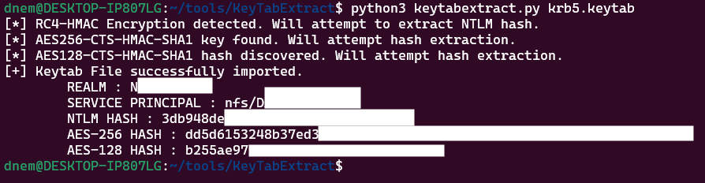
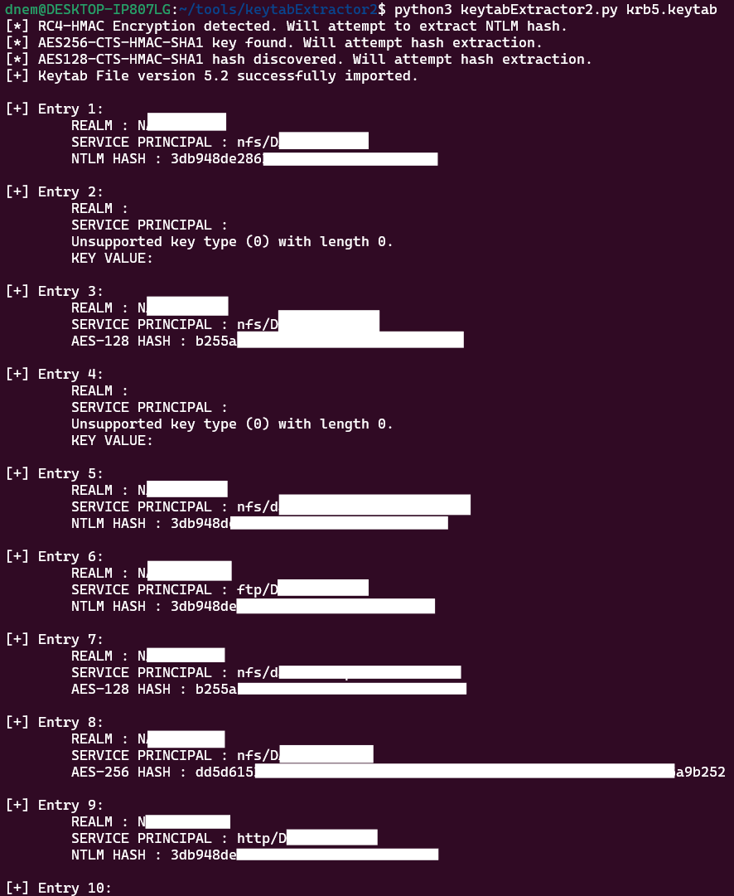
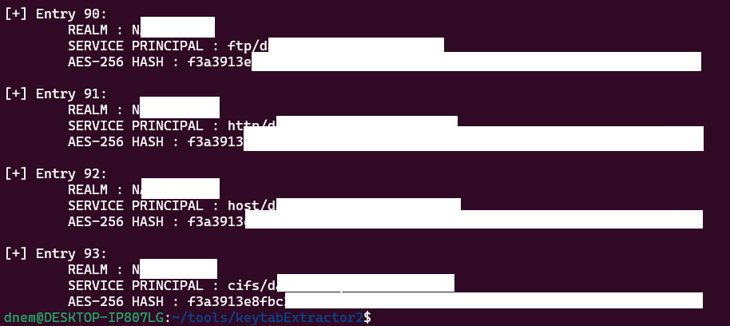

# keytabExtractor2

Fully based on the original https://github.com/sosdave/KeyTabExtract. 

Fixing the old tool which only dumped one entry from a keytab file then stopped.

Original tool: 

keytabExtractor2 with the same keytab file: 

It is useful if you need a key for a specific service, such as nfs, http, host, cifs, etc.
